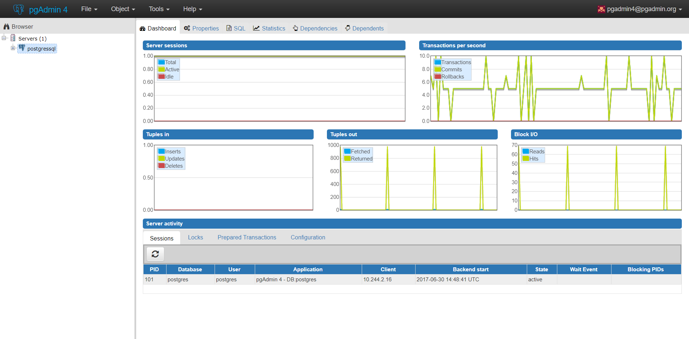

# PGAdmin
This is a single Helm chart that deploys a pgAdmin instance to your Kubernetes cluster.

## Prerequisites
This install assumes you have an existing Kubernetes cluster installed and a [postgresql](https://github.com/kubernetes/charts/tree/master/stable/postgresql) instance deployed.

TLS support requires the [cert-manager](https://github.com/jetstack/cert-manager) Kubernetes add-on to be deployed into your cluster.

## Chart Configuration

The defaults in `values.yaml` will make your pgAdmin deployment accessible by its IP address over plaintext HTTP.

To access your pgAdmin instance using a domain name over *plaintext HTTP*:

1. set `service.type` to `NodePort`
2. set `ingress.enabled` to `true`
3. reserve a static IP address in your Kubernetes cluster (using e.g. `gcloud compute addresses create my-pgadmin-static-ip --global` for GCP)
4. set `ingress.staticIPReservation` to the name of the static IP address reservation you created in step 3
5. At your domain registrar, create an A record pointing to the static IP address you reserved in step 3

To access your pgAdmin instance using a domain name over *HTTPS*, do the above steps, and as well:

6. Set `ingress.tls.enabled` to `true`
7. Set `ingress.tls.clusterIssuer` to the name of a [cert-manager](https://github.com/jetstack/cert-manager) `ClusterIssuer` deployed in your Kubernetes cluster
8. Set `ingress.tls.externalDNSName` to the (fully-qualified) domain name you registered in step 5

## Package
Once you've cloned this repo, you can create your helm package by running the following command in the repo's root directory:
```
helm package .
```

## Install
After packaging the chart, you then install it into your Kubernetes cluster by targeting the packaged archive:
```
helm install pgadmin-0.1.0.tgz
```
Optionally, you can provide a custom username and password:
```
helm install --set pgadmin.username=myuser,pgadmin.password=mypassword pgadmin-0.1.0.tgz
```
The deployment will take a while to provision a public IP for the service. You can watch for this using the following command:
```
kubectl get svc -w -l app=pgadmin
```

## Configure
When the deployment has finished and you have an external IP for your pgAdmin service, you can go to the pgAdmin portal at `http://{external-ip}:5050/`.

**Default Credentials:** \
*username:* pgadmin4@pgadmin.org \
*password:* admin

Once logged in, add a new server and provide the Cluster IP, username and password for your postgres service.


